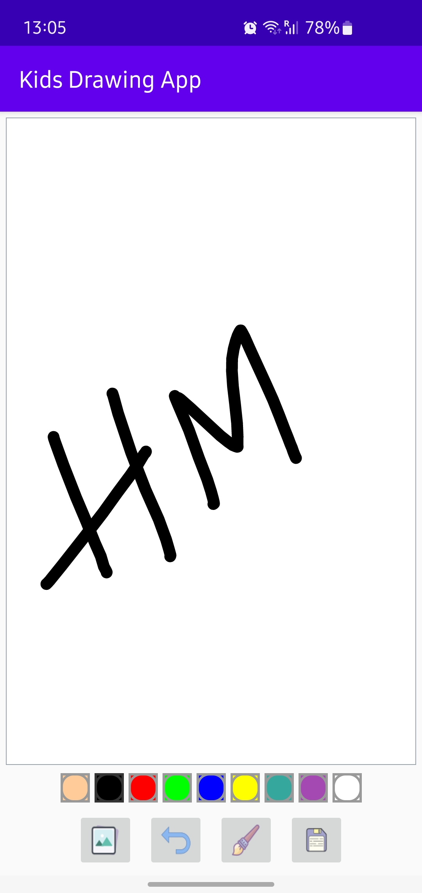

# Drawing-Android-App

<div>

</div>

# Installation

1. Clone the repo
```git
git clone https://github.com/himanshu-matharu/Drawing-Android-App.git
```
2. Open the project on Android Studio.
3. Build and Run.
